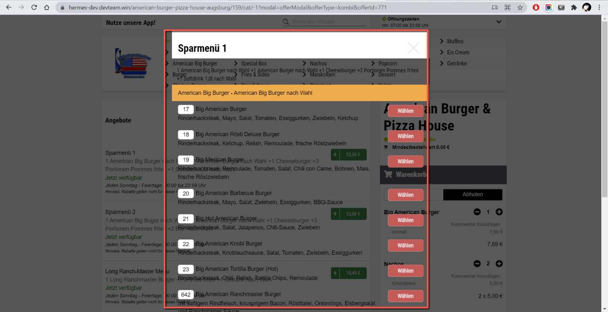
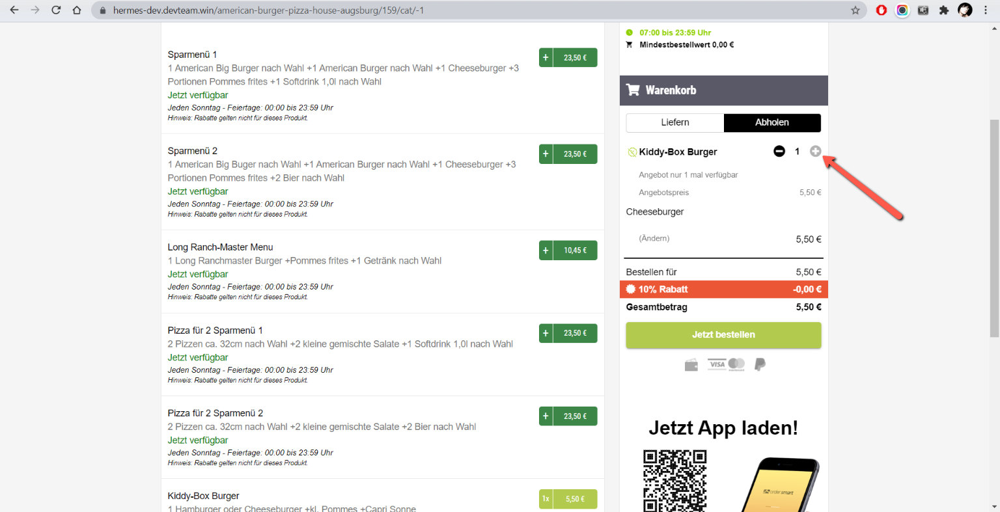

### 1. Chosen environment
https://hermes-dev.devteam.win/american-burger-pizza-house-augsburg/159

### 2. Test Scenario
- Check upper menu navigation;
- Check search in header;
- Check combo functionality (e.g. "Sparmenü 1" combo can be combined only from specified products)
- Check purchase (total cost);
- Check payments;
- Check UI (all elements are on appropriate places);
- Check responsiveness of UI.
- Check requests and console in browser dev tools.

### 3. Test cases

#### Test case 1:   
_Description:_ Search works.   
_Steps:_    
  * Open main page;    
  * Type "Carbonara" in search field.      

_Expected result:_ "Carbonara" is in search result.   

#### Test case 2:   
_Description:_ Product is added to cart with correct price.   
_Steps:_    
  * Open main page;    
  * Click on type of food (e.g. Burger).     
  * Click on "Add" button for Cheeseburger
  * Click on Pick up option
  * Click on "Submit" button

_Expected result:_ Cheeseburger is shown in the cart with correct price.  

#### Test case 3:   
_Description:_ Qty of product can be increased via Cart.   
_Steps:_    
  * Open main page;    
  * Click on type of food (e.g. Wraps);     
  * Click on "Add" button for "Beef'n Cheese Wrap";
  * Click on "Submit" button;
  * Click on "+" icon in the Cart.

_Expected result:_ Qty is increased by 1, total price is increased.

#### Test case 4:   
_Description:_ Success purchase by Cash.   
_Steps:_    
  * Open main page;    
  * Add any product to cart;
  * Check that "Pickup" option is chosen;
  * Click on "Order now" button;
  * Fill address date (remember email address);
  * Click on "To Cashdesk" button;
  * Choose "Bar" option
  * Set "I agree" checkbox
  * Click on "Pay" button
 
_Expected result:_ "Ihre Bestellung wurde erfolgreich an uns übermittelt! Eine Bestellbestätigung wurde an folgende E-Mail-Adresse gesendet: {email}."  message is shown.

#### Test case 5:   
_Description:_ Not available product can't be purchased.   
_Steps:_    
  * Open main page;    
  * FInd product which is not available ("OREO® Donut");
  * Click on disabled "Add to cart" button;
  * Check that modal is shown;
  * Click on Submit button;
  * Check that nothing happens;
  * Click on "Back" button.

_Expected result:_ Modal is closed, Cart is empty.

#### Test case 6:   
_Description:_ Search by non-existing product works.   
_Steps:_
* Open main page;
* Type "testtest" in search field.

_Expected result:_ "Leider wurden keine Produkte gefunden." is shown.

### 4. UI Automation
Made on Java + Selenide.   
Please, check [src/test/java/tests](src/test/java/tests).

Start tests with `mvn test` command.

### 5. API Automation
Few simple tests were made with Postman.
Please, check [appSmart.postman_collection.json](appSmart.postman_collection.json).

### 6. Found bugs

#### Bug 1
_Description:_   
Background for modal windows is transparent.

_Priority:_
P2 - High

_Steps:_
1. Open https://hermes-dev.devteam.win/american-burger-pizza-house-augsburg/159.   
2. Click on "Angebote" in Category menu.   
3. Click on "Sparmenü 1".   
4. Check background of modal window.   

_Actual result:_   
Background is transparent.

_Expected result:_   
Background is not transparent. Font is readable.

_Note:_   
Happened on Win10, Chrome browser 94.0.4606.61.
Also reproducible with other types of modal windows, e.g. "Möchten Sie den Artikel wirklich entfernen?" modal.

#### Bug 2
_Description:_   
Not possible to add qty in Cart for some products, e.g. "Kiddy-Box Burger"

_Priority:_
P3 - Middle

_Steps:_
1. Open https://hermes-dev.devteam.win/american-burger-pizza-house-augsburg/159.
2. Click on "Angebote" in Category menu.
3. Click on green button near "Kiddy-Box Burger".
4. Choose any option.
5. Add to Cart.
6. Check plus in the Cart.

_Actual result:_   
It's not possible to click on plus in the Cart.

_Expected result:_   
It's possible to increase qty via Cart.

_Note:_   
Happened on Win10, Chrome browser 94.0.4606.61.

### 7. Codewars
https://www.codewars.com/users/StrategDZR
